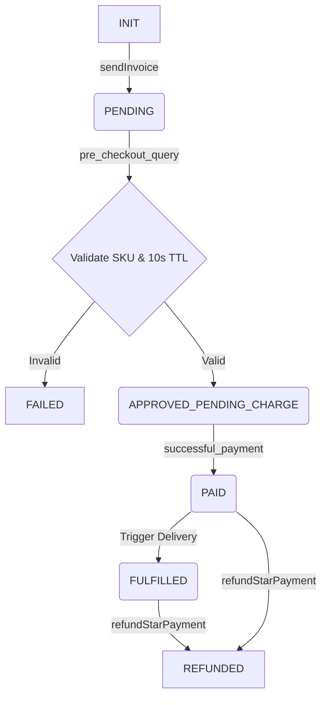

# Nova Reign: Hardened Payment Architecture & State Machine

## 1. System Architecture

The payment system is designed with strict separation of concerns, ensuring that public webhooks cannot access premium storage or delivery authority without a verified state transition.

### Components
- **Webhook Receiver (Public)**: Validates incoming Telegram HTTP POSTs, checks rate limits, and routes to the State Machine. Redacts all message bodies from logs.
- **State Machine (Internal)**: Enforces idempotent transitions (e.g., `PENDING` -> `PAID` -> `FULFILLED`).
- **Database (Internal)**: SQLite/PostgreSQL storing orders, audit logs, and the SKU allowlist.
- **Delivery Authority (Premium)**: Only triggered by the State Machine after a `PAID` state is confirmed. Has access to premium media paths.
- **Secret Store (Isolated)**: Environment variables only. No secrets in code, logs, or DB.

### Privacy Controls
- **Privacy Gate**: Secretary Mode requires an explicit list of allowed Group Chat IDs. If a group is not on the allowlist, the bot drops the message silently.
- **Data Minimization**: Group chat messages are NOT persisted. Only order-related data is saved. Logs redact `message.text` and `message.caption`.

---

## 2. Database Schema

```sql
-- The Server-Side Allowlist (Immutable by users/LLMs)
CREATE TABLE sku_allowlist (
    sku_id VARCHAR(50) PRIMARY KEY,
    title VARCHAR(100) NOT NULL,
    description TEXT NOT NULL,
    price_stars INTEGER NOT NULL,
    media_url TEXT NOT NULL,
    is_active BOOLEAN DEFAULT TRUE
);

-- The Order Ledger (Idempotent tracking)
CREATE TABLE orders (
    internal_order_id VARCHAR(100) PRIMARY KEY,
    telegram_user_id BIGINT NOT NULL,
    chat_id BIGINT NOT NULL,
    sku_id VARCHAR(50) REFERENCES sku_allowlist(sku_id),
    amount INTEGER NOT NULL,
    currency VARCHAR(10) DEFAULT 'XTR',
    payload VARCHAR(255) NOT NULL,
    telegram_payment_charge_id VARCHAR(255),
    provider_payment_charge_id VARCHAR(255),
    state VARCHAR(20) NOT NULL, -- PENDING, PAID, FULFILLED, REFUNDED, FAILED
    created_at TIMESTAMP DEFAULT CURRENT_TIMESTAMP,
    updated_at TIMESTAMP DEFAULT CURRENT_TIMESTAMP
);

-- Durable Audit Log (Append-only)
CREATE TABLE audit_logs (
    log_id SERIAL PRIMARY KEY,
    internal_order_id VARCHAR(100) REFERENCES orders(internal_order_id),
    action VARCHAR(50) NOT NULL, -- PRE_CHECKOUT, SUCCESSFUL_PAYMENT, DELIVERY, REFUND
    status VARCHAR(20) NOT NULL,
    details JSONB,
    created_at TIMESTAMP DEFAULT CURRENT_TIMESTAMP
);

-- Privacy Allowlist
CREATE TABLE allowed_groups (
    chat_id BIGINT PRIMARY KEY,
    added_by VARCHAR(100),
    added_at TIMESTAMP DEFAULT CURRENT_TIMESTAMP
);
```

---

## 3. Payment State Machine

The system enforces strict state transitions. A payment cannot be fulfilled unless it reaches the `PAID` state via a verified `successful_payment` update from Telegram.



### Idempotency Rules
1. If `pre_checkout_query` is received for an order already in `APPROVED_PENDING_CHARGE`, return `ok: true` immediately.
2. If `successful_payment` is received for an order already `PAID` or `FULFILLED`, acknowledge Telegram but DO NOT re-deliver.
3. Content is NEVER delivered on `pre_checkout_query`. Delivery ONLY happens upon transition to `FULFILLED`.

---

## 4. Live-Activation Gates

The system remains in **HOLD** status until the following VETS GO conditions are met:

1. [ ] **Codex Audit**: Full codebase scores A+ from Codex 4.1+.
2. [ ] **Test Environment Verification**: End-to-end flow verified using Telegram Test mode.
3. [ ] **Legal/Policy Pages**: `/terms`, `/paysupport`, `/refundpolicy`, and `/privacy` commands are live and populated.
4. [ ] **Secret Scan**: Zero secrets found in repo history.
5. [ ] **VETS GO**: Explicit human authorization to switch from Test to Live.
